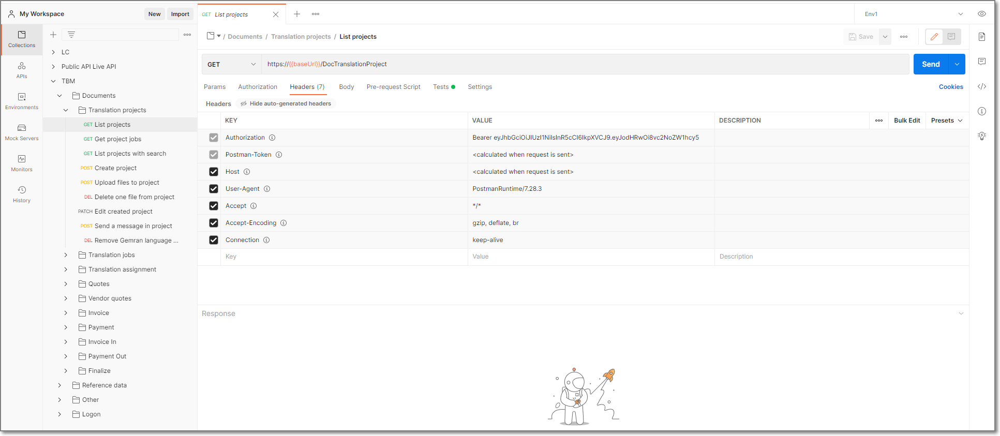
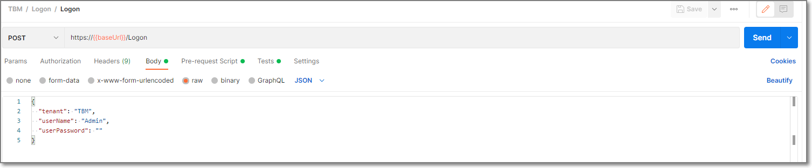
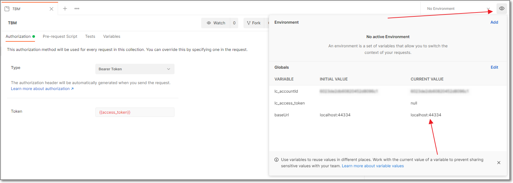
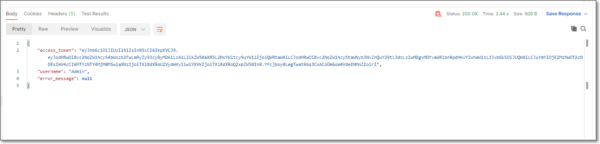

# Postman - usage and helper library download #

Postman (https://www.postman.com/) is a great tool used by many API developers and users to test and use APIs. It provides a lot of possibilities to automate things and make API usage much easier.

To make it easier for your to start with TBM API, we have created a library for postman, which contains a lot of sample API calls, from reading simple lists, to creating projects, uploading files and deleting temporarily created data. You can download zip file by **[clicking here](../images/TBM.postman_collection.zip)**. Then, extract zip archive, run Postman and select **File > Import** to load json file. In the result, you should get the following tree:

You can start with **Logon > Logon** item, which allows to get a token to access library. When you open this request, you will find that URL contains **{{baseUri}}** variable:

You have to fill this variable in the variable list, and your URL will be correctly applied to all requests contained in the library:

Then, fill correct user name and password in the request body and send the request. In the result you will get a response with access token:

Nice part here is that you don't have to copy this access token manually and paste it somewhere. It will be saved automatically and attached to all your future requests. For this, **{{access_token
}}** variable will be used. So, if logon request was successful, you can move to any other requests contained in the library, and it will be processed correctly from a currently logged in user.